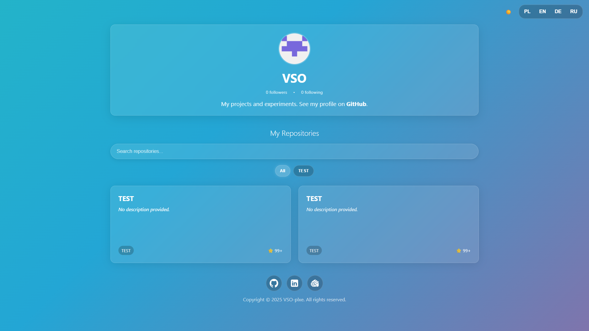

  <a href="README.md">Polski</a> | 
  <a href="README.en.md">English</a> | 
  <strong>Deutsch</strong> | 
  <a href="README.ru.md">Русский</a>

# VSO-plxe — Dynamisches Portfolio

Willkommen in meinem persönlichen Portfolio-Repository! Dies ist keine einfache statische HTML-Seite. Es ist eine vollständig dynamische, datengesteuerte Single Page Application, die sich automatisch mit meinem GitHub-Profil synchronisiert.

### 🔗 **[Live ansehen: VSO-plxe.github.io](https://vso-plxe.github.io)**

---

---

## 🚀 Funktionen

Diese Seite wurde von Grund auf neu erstellt, um meine Projekte auf moderne und interaktive Weise zu präsentieren.

* **🌐 Vollständige Internationalisierung (i18n):**
    * Automatische Erkennung der Browsersprache (PL, EN, DE, RU).
    * Manueller Sprachumschalter, der die Auswahl im `localStorage` speichert.
    * Alle Texte auf der Seite werden dynamisch aus externen `.xml`-Dateien geladen.

* **🤖 GitHub API-Integration (REST):**
    * **Dynamisches Profil:** Die Seite ruft automatisch meinen Avatar, meine Biografie und die Anzahl meiner Follower/Following ab.
    * **Automatische Repo-Liste:** Das Portfolio ruft meine 30 zuletzt aktualisierten Repositories ab und filtert Forks heraus.

* **🌗 Hell/Dunkel-Modus-Umschalter:**
    * Automatische Erkennung der Systemeinstellungen (`prefers-color-scheme`).
    * Manueller ☀️/🌙-Umschalter, der die Auswahl des Benutzers speichert.
    * SVG-Symbole in der Fußzeile ändern dynamisch ihre Farbe (von weiß auf schwarz) mithilfe von CSS-Filtern.

* **⚡ Interaktive Benutzeroberfläche (UI):**
    * **Live-Suchleiste:** Filtert Repositories in Echtzeit während der Eingabe.
    * **Sprachfilter:** Generiert automatisch Filter-Schaltflächen basierend auf den Sprachen in den abgerufenen Repos (z. B. "JavaScript", "Python").
    * **Laden der README im Modal:** Ein Klick auf eine Projektkarte öffnet ein Modal, das die `README.md`-Datei aus diesem Repository abruft, parst (`marked.js`) und anzeigt, ohne die Seite zu verlassen.

* **✨ Modernes Design und UX:**
    * **"Skeleton Loaders":** Anstelle eines langweiligen "Laden..."-Textes werden schimmernde Karten-Skelette angezeigt, was die wahrgenommene Leistung verbessert.
    * **Fade-in-Animationen:** Projektkarten werden beim Scrollen mithilfe der `Intersection Observer API` sanft eingeblendet.
    * **"Glassmorphism"-Design:** Halbtransparente, verschwommene Hintergründe für einen modernen Look.
    * **Fließender animierter Hintergrund:** Ein mehrfarbiger, animierter Verlauf in CSS.
    * Vollständige Responsivität (RWD) auf mobilen Geräten.

---

## 🛠️ Tech-Stack

Dieses Projekt wurde bewusst **ohne Frameworks** (wie React oder Vue) erstellt, um ein tiefes Verständnis der Web-Grundlagen zu demonstrieren.

* **Frontend:** Natives HTML5, CSS3 und JavaScript (ES6+).
* **Design:**
    * CSS Variables (für dynamische Themes).
    * CSS Flexbox & Grid (für responsives Layout).
    * CSS Animations & Transitions.
* **Anwendungslogik (JavaScript):**
    * **Async/Await** mit **Fetch API** zur Handhabung von GitHub-API-Anfragen und zum Laden von XML-Dateien.
    * **DOMParser** zum Parsen von Lokalisierungs-`.xml`-Dateien.
    * **Intersection Observer API** für Scroll-Animationen.
    * **localStorage** zum Speichern von Benutzereinstellungen (Sprache, Theme).
* **Externe Bibliotheken:**
    * **[Marked.js](https://marked.js.org/):** Für die sofortige Konvertierung von Markdown -> HTML im Modal.
* **Hosting:**
    * **GitHub Pages**

---

## 📄 Lizenz

Dieses Projekt ist unter der [MIT-Lizenz](LICENSE) lizenziert.